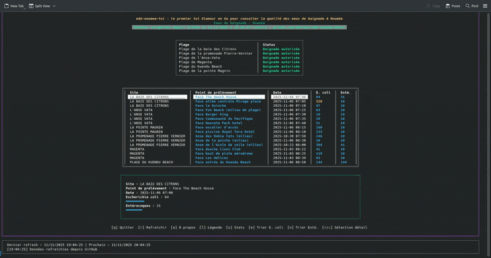

[](https://taskfile.dev/)
[](https://github.com/adriens/edb-noumea-data)




# ❔ A propos

TUI pour consulter la qualité les données des eaux de baignade de Nouméa...
sans quitter son terminal... parce'que c'est cool.

## Prérequis

- Go 1.23 ou supérieur (recommandé Go 1.24)
- Avoir [`task`](https://taskfile.dev/) installé
- Accès à internet (pour télécharger le CSV)


## Compilation

Dans le dossier du TUI :
```sh
task
```

## Exécution


```sh
./edb
```


## Dépendances principales

- [Bubbletea](https://github.com/charmbracelet/bubbletea) (TUI)
- [Lipgloss](https://github.com/charmbracelet/lipgloss) (styles)

## Source des données

- [`github.com/adriens/edb-noumea-data`](https://github.com/adriens/edb-noumea-data)
